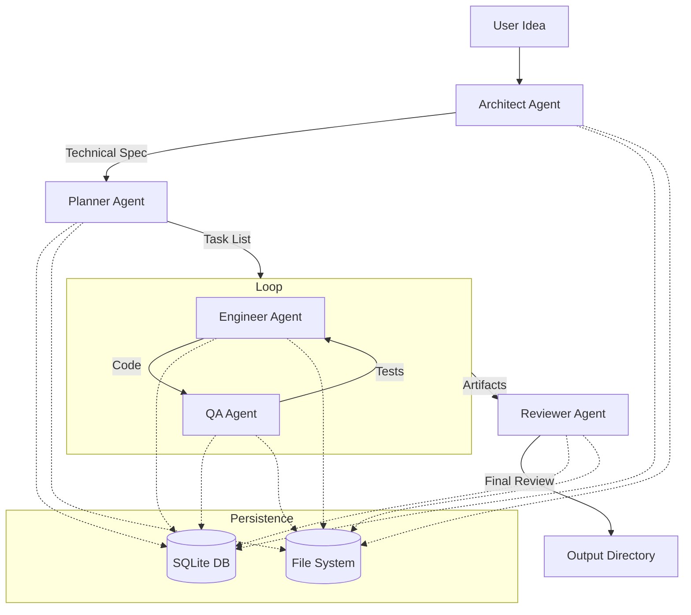

# SPEC-TO-SHIP: Production-Grade Multi-Agent Engineering Pipeline

SPEC-TO-SHIP is a fully automated, production-grade multi-agent engineering pipeline that transforms raw feature ideas into committed, tested code. The system orchestrates five specialized AI agents (Architect, Planner, Engineer, QA, Reviewer) within a single Node.js process to simulate a complete startup engineering team workflow.

## 🏗 Architecture

The pipeline follows a sequential flow where each agent's output informs the next, with a tight loop between Engineering and QA.



### The Five Agents

1.  **ArchitectAgent (Senior Software Architect)**:
    - **Responsibility**: Generates a comprehensive technical specification (PRD + Design).
    - **Output**: Markdown spec with Overview, Goals, API Contracts, Data Models, and Security sections.
    - **Model**: `google/gemini-2.0-flash-001` (via OpenRouter).

2.  **PlannerAgent (Staff Engineering Manager)**:
    - **Responsibility**: Breaks the spec into actionable, dependency-aware development tasks.
    - **Output**: JSON array of tasks with topological ordering and acceptance criteria.

3.  **EngineerAgent (Principal Software Engineer)**:
    - **Responsibility**: Implements production-grade TypeScript code for each task.
    - **Output**: Source files with proper typing, error handling, and JSDoc.

4.  **QAAgent (Senior QA Engineer)**:
    - **Responsibility**: Writes exhaustive Vitest test suites for each task.
    - **Output**: Test files covering acceptance criteria and edge cases.

5.  **ReviewerAgent (Principal Engineer Reviewer)**:
    - **Responsibility**: Conducts a final audit across security, performance, and correctness.
    - **Output**: Score (0-100) and approval status.

## 🚀 Getting Started

### Prerequisites
- Node.js 20+
- OpenRouter API Key

### Installation
1. Clone the repository.
2. Install dependencies:
   ```bash
   npm install
   ```
3. Configure environment:
   ```bash
   cp .env.example .env
   # Edit .env and add your OPENROUTER_API_KEY
   ```

### Usage

#### Terminal UI (CLI)
Run the interactive CLI to start a new pipeline:
```bash
npm run start
```
The CLI uses **Ink** to provide real-time status updates and token streaming.

#### Industrial Dashboard
1. Start the API server:
   ```bash
   npm run dev
   ```
2. Open `dashboard/index.html` in your browser.
3. The dashboard features an "Industrial Command Center" aesthetic (Dark Charcoal & Amber Glow) and uses **Server-Sent Events (SSE)** for real-time observability.

## 🛠 Configuration
The system uses `envalid` for robust configuration management:
- `OPENROUTER_API_KEY`: Required for LLM access.
- `DEFAULT_MODEL`: Set to `google/gemini-2.0-flash-001`.
- `PORT`: API server port (default: 3000).
- `DB_PATH`: SQLite database path (default: `spec-to-ship.db`).

## 📁 Output Structure
Artifacts are stored in `./output/{runId}/`:
- `spec.md`: Architectural specification.
- `tasks.json`: Task breakdown.
- `src/`: Implementation code.
- `tests/`: Vitest tests.
- `review.md`: Final review report.
- `meta.json`: Token usage, cost, and timing.
- `pipeline.log`: NDJSON event log.

## 🛡 Quality & Resilience
- **Strict TypeScript**: No `any` types allowed.
- **Exponential Backoff**: Retries on 429/529 errors (1s, 2s, 4s, 8s, 16s).
- **JSON Robustness**: Automatic retry with explicit instructions on JSON parse failures.
- **Timeout**: Hard 20-minute limit per pipeline run.
